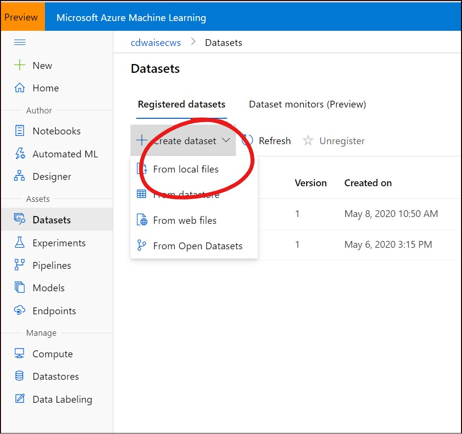
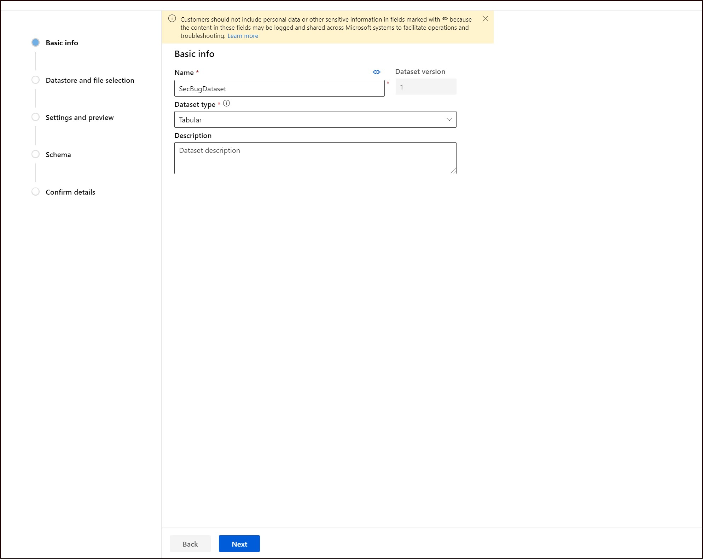
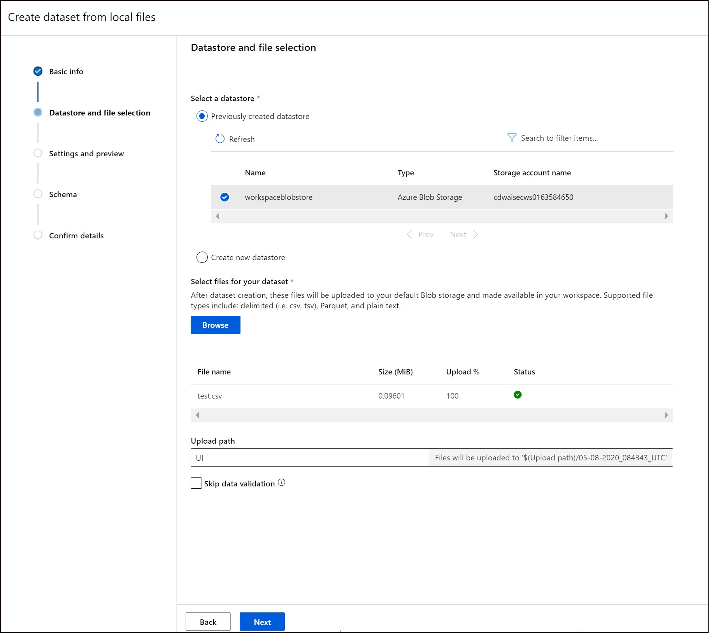
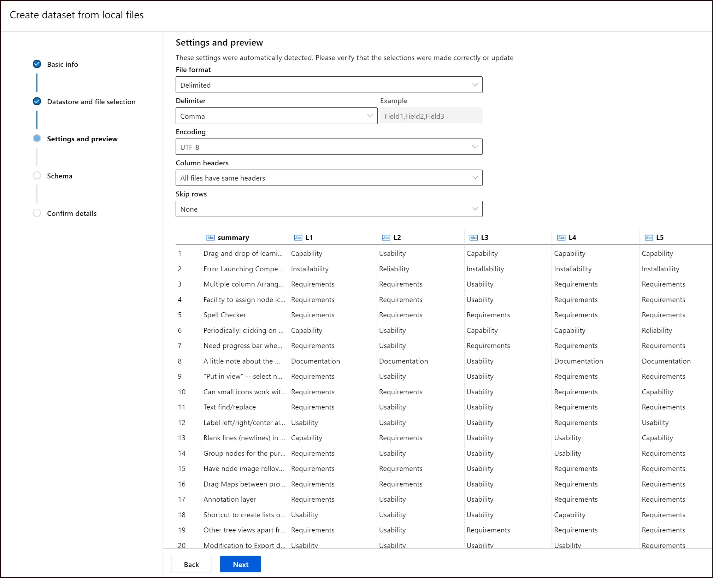
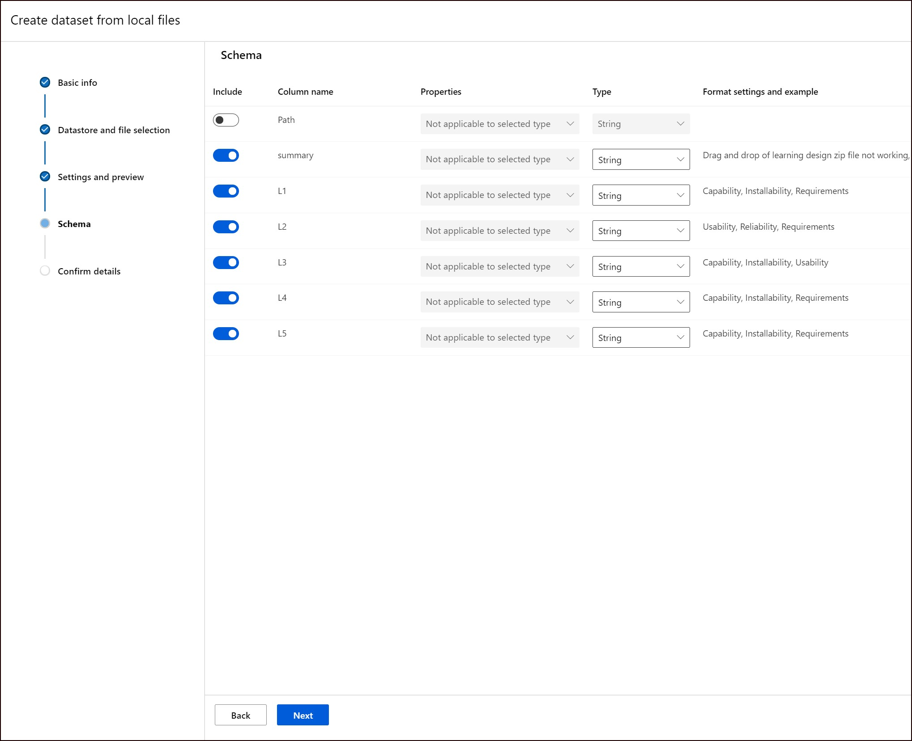
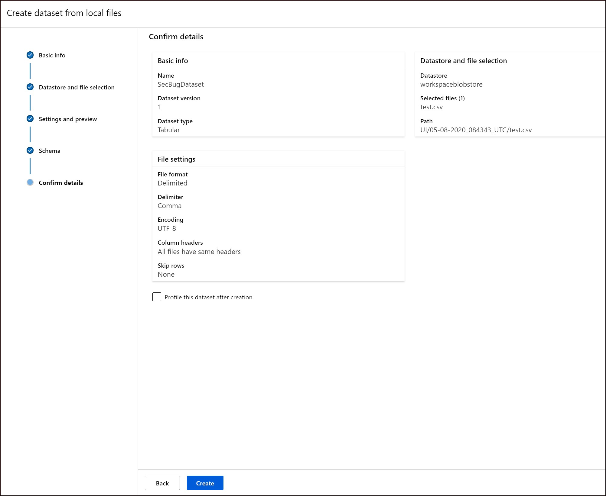
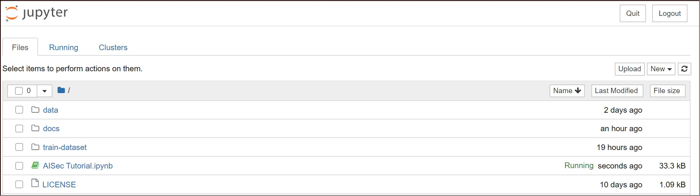

# AiSec

## Overview

The inspiration for this example comes from a recent publication from Microsoft, "Secure the software development lifecycle with machine learning":
https://www.microsoft.com/security/blog/2020/04/16/secure-software-development-lifecycle-machine-learning/  

The dataset in this project contains 12 million work items and bugs. The ML model is built from classifying the dataset titles only. The goal is to separate security from non-security related bugs with high accuracy, and from the security related bugs - labeling them into 'critical' and 'high priority'/'non-critical'. We will be recreating a small example of this in code, but only for demo and educational purposes. The goal is to illustrate how this can be done and how AI can be used in the Security field. 

In order to recreate an example of this, we needed a sample dataset of bug reports labeled 'security'/'non-security' bugs. A dataset that suits the purpose has been published through this scientific article: ["Two datasets of defect reports labeled by a crowd of annotators of unknown reliability"](https://www.sciencedirect.com/science/article/pii/S2352340918303226). It is an open access article distributed under the terms of the Creative Commons [CC-BY license](https://creativecommons.org/licenses/by/4.0/), and the collected bug reports were categorized by a set of annotators of unknown reliability according to their impact from IBM's orthogonal defect classification taxonomy. 

We will be using the bug label "Integrity/Security" to represent the security label and all other labels are considered non-security. We extract only the fields that we will be using, the summary and label fields. The resulting dataset can be found in csv-format in the "data" directory of this repository. It contains 962 rows. 

## How to - guideline

1. Clone or download [this repository](https://github.com/cecilidw/aisec) - you'll have all the assets available to run locally. At minimum, you will need at least "AISec Tutorial.ipynb" locally
2. Follow the instructions for setting up an Azure Machine Learning Workspace from [MS documentation](https://docs.microsoft.com/en-us/azure/machine-learning/how-to-manage-workspace). You the difference between the Basic and Enterprise version can be found [here](https://azure.microsoft.com/en-us/pricing/details/machine-learning/). For this example choose Enterprise version.
You will be creating Machine Learning resources in your Azure subscription. If you don't have an Azure Subscription from before, you can follow the steps [here](https://azure.microsoft.com/en-us/trial/get-started-machine-learning/) to get a trial version. 

3. When the Azure Machine Learning environment is ready, navigate to your resources and open Azure Machine Learning UI by clicking `Try the new Azure Machine Learning studio -> Launch now` under `Overview`. You will now create dataset through this interface by uploading "secBugData.csv" located in "data" folder of the cloned repository. Give a name "SecBugDataser" for your dataset. To do this follow these steps:
     * Choose `Create dataset -> from local files` under `Assets -> Datasets` menu on the left side
     
     * Give your dataset a name, "SecBugDataset" and leave other fields defaults. Press `Next`
     
     * Choose `Previously created datastore` and `workspaceblobstore`. This is the default storage that was created with your workspace. Then under `Select files for your dataset` press `Browse` and upload file "secBugData.csv" located under "data" folder in the cloned repository. After file is uploaded you will see it under the `File name`. Press `Next`  
     
     * On the next step `Settings and preview` you will see loaded data set as table with columns. Leave all settings defaults except `Column headers`. Choose `All files have same headers` under the `Column headers` in the dropdown menu. Press `Next`
     
     * On the next step `Schema` go with the default settings and click `Next`
     
     * On the last step review and confirm details by pressing `Create`
     
     * You will see the confirmation that the data set has been created successfully.

4. Now it is a time to configure a development environment for Azure Machine Learning on your computer. Follow the instructions on how to set up from [Microsoft documentation](https://docs.microsoft.com/en-us/azure/machine-learning/how-to-configure-environment#local). 
   
   **NOTE**: When you get to the step where you start Jupyter by using the command `jupyter notebook`, make sure you have navigated to the folder you cloned/downloaded in **Step 1**. Perform all the steps up until the section "Visual Studio Code". If, at any time during the execution of the notebook, the system complains that you have incompatible versions of pyarrow and pandas, add this to one of the notebook cells and execute: `!pip install azureml-dataprep[pandas]`.

5. You are now ready to run through the notebooks with this example from Jupyter on your local machine. If you've followed the instructions in **Step 4**, you should be able to open the AISec Tutorial notebook by clicking on this:
. When you've finsihed running it, you can contunue with the AISecAutoML notebook.
6. When you've finished running the two notebooks, you should have two endpoints deployed in your AML workspace. You can get the endpoint either from the output in the tutorial, or you can find it in your workspace, under Endpoints. Use this endpoint in your security application, pass it the security bug title as input and expect a classification score as output. 

## Useful links and presentation for AiSec example

[Securing the Software Development Lifecycle with Machine Learning, presentation from RSA 2020](https://www.rsaconference.com/usa/agenda/securing-the-software-development-life-cycle-with-machine-learning)
[Threat Modeling AI](https://docs.microsoft.com/en-us/security/engineering/threat-modeling-aiml)
